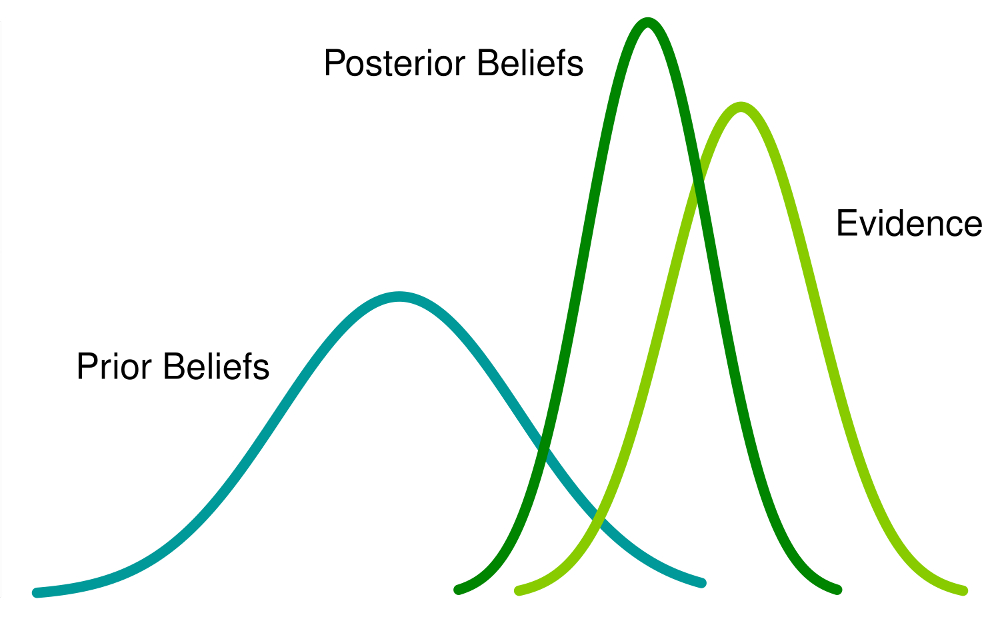
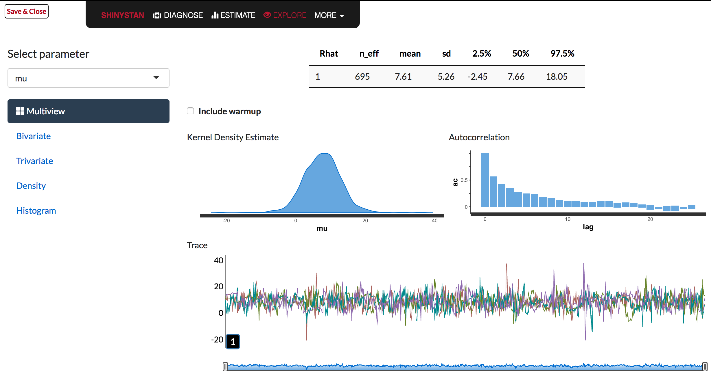

```{r setup, include=FALSE}
knitr::opts_chunk$set(echo = FALSE)
library("lmerTest")
library("rstanarm")
library("tidyverse")
library("knitr")
options(mc.cores=parallel::detectCores ()) # Run on multiple cores
```

## Introduction

- Linear Mixed Effect Regressions (LMERs) are the new go-to standard in phonetic research
- Bayesian inference is however the new hot topic in statistics
- Bayesian models historically were hard to code, often with fairly low-level C++ code that required expert knowledge in statistics (would you use `lme4` if you had to code the underlying model from scratch each time?)
- Were also resource intensive and could take hours to days to run
- New R package `rstanarm` makes it much easier and faster to run Bayesian models


## Overview of Presentation

- Bayesian vs. frequentist inference
- Bayes' Theorem
- Example of Bayesian inference
- Bayesian LMERs with `rstanarm` package
    - how to code models
    - selecting priors
    - displaying & interpreting the posterior distribution
    - model diagnostics and comparisons
- Presentation assumes knowledge of `lme4` package
    
## Package Requirements

- `rstanarm` for Bayesian models
- `lmerTest` for frequentist models
- `tidyverse` for data manipulation
- `bayesplot` for plotting models
- `loo` for model comparison
- code and presentation are available at 
    - <http://github.com/rentzb/bayesian-pape>
    

# Bayesian vs. Frequentist Inference

## Frequentist Inference

- Uses only the **data** and compares them to an **idealized model** to make inferences about the data

## Frequentist Example

- **Example Problem:** You lose your phone in your office building. You have someone call it and you listen for the sound to find it. Where do you search in the building?

- **Frequentist solution:** You can hear the phone ringing (data). You also have a mental model of the building that helps you identify where the sound is coming from. When you hear the phone ringing, you infer the location with the help of your model.

## Bayesian Inference

- Draws conclusions from **data** and  **prior information** about the data including **idealized models**
- Uses prior information to make bets on the outcome
    - Bet on how strongly the prior information is believed

## Bayesian Example Solution

- **Data**: can hear the phone ringing 
- **Prior knowledge:** also know where you were in the building today and where you tend to lose things. 
- **Model:** Also have a mental model of the building. 
- You combine the inferences from the ringing with your prior knowledge and mental model to find the phone


## Bayes' Theorem

- $P(Hypothesis\mid Data) = \frac{P(Data \mid Hypothesis) \, P(Hypothesis)}{P(Data)}$
- The probability of observing the hypothesis given the data equals the probability of observing the data given the hypothesis is true times the probability of observing the hypothesis divided by the probability of the data
- $P(Hypothesis\mid Data)$ = posterior probability
- $P(Data\mid Hypothesis)$ = likelihood
- $P(Hypothesis)$ = prior probability
- $P(Data)$ = probability of data (the evidence)
    
## Bayesian Terms

- **Prior probability** = beliefs about the events prior to looking at the new data (what is already known)
- **Likelihood** = how likely the data are given a hypothesis 
- **Posterior probability** = the state of belief after comparing the prior information to the likelihoods (and updating with new data)
- $Posterior\ probability = \frac{likelihood * prior\ probability}{evidence}$

## What they look like




# Applying Bayesian inference to LMERs

## Applying Bayesian Inference

- Bayesian inference can be applied to most models (ANOVA, linear regression, GLMERs, LMERs, GAMMs, CLMs, etc.)
- Provides distributions of values for each parameter rather than a single output

## Bayesian Inference in R
- Real phonetics data is much more complex than the earlier example, so can't directly calculate the posterior distribution
- Instead have to approximate posterior distributions
- Use the `rstanarm` package interface for the Stan language to generate  posterior distributions via Markov Chain Monte Carlo sampling for each regression output 
    - This process takes time (sometimes several minutes) and requires thousands of samples but is more efficient (faster!) and easier than BUGS or JAGS (other Bayesian samplers) 


## rstanarm

- High-level coding (no C++ coding needed!)
- Active development and good documentation
- main functions: `stan_lmer()` or `stan_glmer()`
- Similar syntax to `lme4` but have to specify
    - priors
    - number of chains
    - iterations
    - `adapt_delta` (optional)
- Models are pre-compiled and optimized so rarely have very bad sampling problems
- Comes with full suite of diagnostic/exploratory tools too

## Selecting priors

- No matter what we research, we already know something about the data we will collect before we do
- For phonetics, we know range of sounds humans can produce and hear
    - We know that it is very unlikely to get meaningful speech sounds that are at 100,000 Hz
    - VOTs are typical not seconds long or conversely not extremely short like 1 ns
- We pick priors that are typically **weakly informative** but still helpful
- We want to make some bets but not bet too strongly to overly influence the results

## Selecting priors (con't)

- We pick priors that are distributions (typically normal) that have a reasonable mean and standard deviation but not too narrow nor too wide
- The priors tell the model where to start sampling the data and how strong of a bet to make
- If we have lots of data that strongly diverge from the priors, then the results won't reflect the priors as much, but if the priors are too strong then they can heavily influence the results

## Example study

- Comparing VOTs between two stops in Pohnpeian (Austronesian, ISO 639-3: pon)
- Between voiceless laminal alveolar stop and voiceless apical dental stop
- Variables: VOT [vot], stop (laminal or alveolar) [consonant2], word [word], and speaker [speaker_id]

## VOT LMER example

- We need to pick priors for the intercept and slopes for VOT data
- What do we know about VOT that are measured in ms?
- We can pick a prior with a normal distribution centered at 0ms with a standard deviation of 50ms: `normal(0,50)`
    - that says we are 68% sure the mean is between --50ms and 50ms, 95% sure between --100ms and 100ms and 99.7% sure between --150ms and 150ms
    - We can tweak it as needed
- What if we said `normal(0,5)`? Is that too strong? Or `normal(0,500)`? Is that too weak?
  
## Sampling the posterior distribution

- Need to specify how many iterations are needed and the number of chains
- Stan is quite efficient so can use a relatively small amount depending on the data
- Typically use `chains = 4` (number of unique samplers) and `iter = 2000`
- The sampling process requires warmup samples to get a taste of the distribution, which throw out since not very good (`warmup = 1000`)
- There can be divergent samples which are bad so we add `adapt_delta=0.999` (if still divergent add more 9s)

## Let's make some models!

- These can take a bit of time to run
```{r, echo=T,eval=T,message=F,cache=T}
data_vot <- read_csv("t_d_vot.csv") # import data
options(mc.cores=parallel::detectCores ()) # Run on multiple cores
# strong priors
model1 <-stan_lmer(vot*1000 ~ consonant2 + (1+consonant2|speaker_id) 
                   + (1|word),
                   data=data_vot,
                   prior_intercept = normal(0, 5),
                   prior = normal(0, 5), 
                   prior_covariance = decov(regularization = 2),
                   chains = 4,
                   iter = 2000, adapt_delta=0.999999,warmup=1000)
```

## More models
```{r, echo=T,eval=T,message=F,cache=T}
# weaker priors
model2 <-stan_lmer(vot*1000 ~ consonant2 + (1+consonant2|speaker_id) 
                   + (1|word),
                   data=data_vot,
                   prior_intercept = normal(0, 50),
                   prior = normal(0, 50), 
                   prior_covariance = decov(regularization = 2),
                   chains = 4,
                   iter = 2000, adapt_delta=0.999999,warmup=1000)
```

## One last model
```{r, echo=T,eval=T,message=F,cache=T}
# very weak priors
model3 <-stan_lmer(vot*1000 ~ consonant2 + (1+consonant2|speaker_id) 
                   + (1|word),
                   data=data_vot,
                   prior_intercept = normal(0, 500),
                   prior = normal(0, 500), 
                   prior_covariance = decov(regularization = 2),
                   chains = 4,
                   iter = 2000, adapt_delta=0.999999,warmup=1000)
```

# Interpreting Results

## What are p-values?


- The probability of getting the results you did (or more extreme results) given that the null hypothesis is true.
- $P(Data\mid null\ hypothesis)$
 
## Intrepreting p-values

- If you are studying the difference in VOT between two stops and the p-value is 0.03 that means:
    - if there were no difference between the VOT of the two stops, you’d get the observed difference or more in 3% of the studies due to random sampling error.
- It does not give us any information about the alternate hypothesis that there is a difference between the stops' VOTs.

## Bayesian Approach

- No p-values!
- Use Bayesian Highest Density Interval (HDI)
    - Area of posterior distribution with 95% highest probability [2.5% to 97.5% of posterior distribution]
- Bayesian approach answers "The probability of the Null Hypothesis being true given the data" $P(Null\ hypothesis\mid Data)$ 
- Frequentist is "The probability of observing the data or anything more extreme given the null hypothesis" $P(Data\mid null\ hypothesis)$
- Bayesian approach is more inuitive


## Intrepreting HDI

- If there is no overlap of HDIs, then probable difference
- If overlap can say there is probable similarity but also probable difference (can now make these fine-grained claims rather than just binary answers!)
- Much more nuanced and like real life
- Multiple comparisons also are not a concern and do not inflate error rate (Gelman & Tuerlinckx 2000)

## Model 1 Results

```{r,echo=T,eval=T,message=F}
# summary gives us results from an entire distribution (n=4000)
summary(model1)
```

## Model 2 Results

```{r,echo=T,eval=T,message=F}
summary(model2)
```

## Model 3 Results

```{r,echo=T,eval=T,message=F}
summary(model3)
```

## Compared to frequentist model

```{r,echo=T,eval=T,message=F,cache=T,warning=F}
model_freq <- lmer(vot*1000 ~ consonant2 + (1+consonant2|speaker_id) 
                   + (1|word),data=data_vot)
summary(model_freq)
```

## Plotting Posterior Distribution: Model1

```{r,echo=F,eval=T,message=F,cache=T,warning=F,fig.height=5}
library(bayesplot)
posterior <- as.matrix(model1)

plot_title <- ggtitle("Posterior dist for model1",
                      "with medians and 95% intervals")
mcmc_areas(posterior, 
           pars=c("(Intercept)","consonant2t̻"), 
           prob=0.95) + plot_title + ggplot2::xlab("VOT (ms)")


```

## Plotting Posterior Distribution: Model2

```{r,echo=F,eval=T,message=F,cache=T,warning=F,fig.height=5}
library(bayesplot)
posterior2 <- as.matrix(model2)

plot_title <- ggtitle("Posterior dist for model2",
                      "with medians and 95% intervals")
mcmc_areas(posterior2, 
           pars=c("(Intercept)","consonant2t̻"), 
           prob=0.95) + plot_title + ggplot2::xlab("VOT (ms)")


```

## Plotting Posterior Distribution: Model3

```{r,echo=F,eval=T,message=F,cache=T,warning=F,fig.height=5}
library(bayesplot)
posterior3 <- as.matrix(model3)

plot_title <- ggtitle("Posterior dist for model3",
                      "with medians and 95% intervals")
mcmc_areas(posterior3, 
           pars=c("(Intercept)","consonant2t̻"), 
           prob=0.95) + plot_title + ggplot2::xlab("VOT (ms)")


```


# Diagnostics and Comparing Models

## Model Diagnostics

- In summary output want Rhat to be 1.0 or very close to 1 (like 0.98) [measure of how well the chains mix]
- Use `launch_shinystan(model1)` to explore Stan's built in diagnostic tools (launches page in your web browser)

## Example of Shinystan



## How well did the model sample

```{r,echo=F,eval=T,message=F,cache=T,warning=F,fig.height=5}
pp_check(model1)
```


## Model Comparisons

- Like frequentist models, we can compare two different models to see how different they are (like comparing random effects)
- Instead of `anova()` we use `loo()` (leave one out) and `compare_models()` 
- Can take a little bit to run
- `loo()` is actually more like comparing `AIC` values
- If `elpd_diff` is small, then little difference between models


##  Loo

- The LOO Information Criterion (LOOIC) has the same purpose as the Akaike Information Criterion (AIC) that is used by frequentists. 
- Both are intended to estimate the expected log predictive density (ELPD) for a new dataset. 
- A single outlier data point can influence the LOOIC, which the package alerts you to
    - If one exists add `k_threshold=0.7` to `loo()`

## ELPD

- The difference in ELPD will be negative if the expected out-of-sample predictive accuracy of the first model is higher. 
- If the difference is positive then the second model is preferred.
- 0 if no difference.

## Example loo

```{r,echo=T,eval=T,message=F,cache=T,warning=F}
# remove random effect for word
model1a <-stan_lmer(vot*1000 ~ consonant2 + (1+consonant2|speaker_id),
                   data=data_vot,
                   prior_intercept = normal(0, 5),
                   prior = normal(0, 5), 
                   prior_covariance = decov(regularization = 2),
                   chains = 4,
                   iter = 2000, adapt_delta=0.999,warmup=1000)

loo1 <- loo(model1) # first model with both random effects
loo1a <- loo(model1a, k_threshold=0.7) # second model without it
```

## Compare models


```{r,echo=T,eval=T,message=F,cache=T,warning=F}
compare_models(loo1,loo1a) # no difference between models
```

# Summary

## Writing model results

- In write-up include:
    - Fixed effects and random effects (just like for lme4)
    - All priors used
    - Number of iterations, chains, and warmup values
    - Text about checking chains (Rhat values) for mixing
    - For model results include mean and HDI (2.5% and 97.5%) at minimum and if HDIs overlap
    - Eg., The laminal alveolar stop has a modeled VOT 31.3 ms [16.6--44.9ms] longer than the apical dental stop
    - Depending on journal, short text about interpreting Bayesian regressions could be helpful

## Pros and cons of Bayesian analyses

- Pros
    - Easier to intrpret
    - No p-values
    - Uses past knowledge (more scientific)
    - Can use more complex models
    - Can do multiple comparisons
    - Have distributions of results
    - Can make more nuanced claims
- Cons
    - Slower
    - New for linguistics so have to explain more
    
## Resources 

- <https://cran.rstudio.com/web/packages/rstanarm/vignettes/lm.html>
- <https://cran.rstudio.com/web/packages/rstanarm/vignettes/continuous.html>
- <https://arbital.com/p/bayes_rule/?l=693>
- <http://www.kevinboone.net/bayes.html>

## References

- Gelman, Andrew & Francis Tuerlinckx. 2000. Type S error rates for classical and Bayesian single and multiple comparison procedures. *Computational Statistics* 15. 373–390. doi:10.1007/s001800000040.


## Questions?

```{r, out.height = "600px"}
knitr::include_graphics("frequentists_vs_bayesians_2x.png")
```

